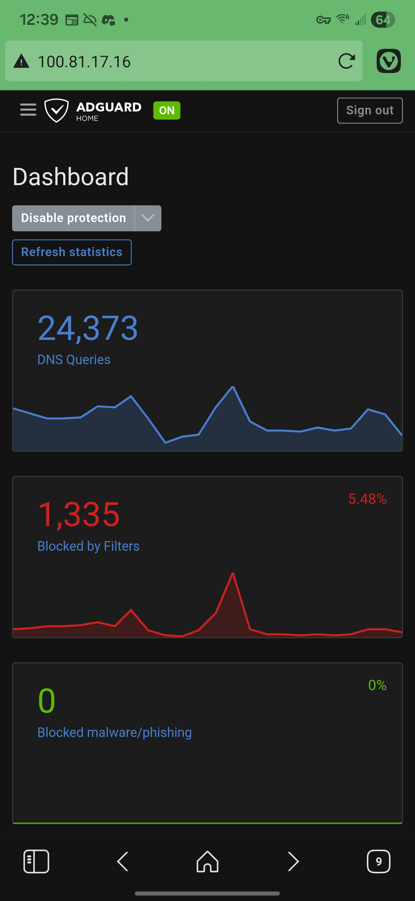

# AdGuard DNS
> Blocks ads for all devices connected to my server. Using Tailscale, this is not limited to being connected to my home network.
## Free Conflicting Port
To begin the installation, we have to clear port 53, since it is currently being used by `systemd-resolved` because I'm using Ubuntu Server. Thus, we have to open the `.conf` file and change it. 

```bash
sudo vim /etc/systemd/resolved.conf
```

Then, we uncomment the line that says:
```conf
#DNSStubListener=yes
```
 and change it to
 ```conf
DNSStubListener=no
 ```
**Then, importantly, we need a public DNS fallback**. Near the top, change:
```
#DNS=
```
into
```
DNS=1.1.1.1 8.8.8.8
```
This is due to an error that I had before creating this change:
```bash
justinh@thinkpad-ubuntu:~/adguard$ docker compose up -d

[+] up 1/1

 ✘ Image adguard/adguardhome Error failed to resolve reference "docker.io/adguard/adguardhome:latest": failed to d... 0.0s

Error response from daemon: failed to resolve reference "docker.io/adguard/adguardhome:latest": failed to do request: Head "https://registry-1.docker.io/v2/adguard/adguardhome/manifests/latest": dial tcp: lookup registry-1.docker.io on 127.0.0.53:53: read udp 127.0.0.1:33178->127.0.0.53:53: read: connection refused
```

And finally, we create a new symlink to the server so that it can still reach the internet, and restart the `systemd-resolved` service.

```bash
sudo sh -c 'rm /etc/resolv.conf && ln -s /run/systemd/resolve/resolv.conf /etc/resolv.conf'

sudo systemctl restart systemd-resolved
```
> Note that I consulted with Google Gemini on this part, I would not have guessed that there was a necessary configuration file change due to Ubuntu running on my server!

## Installation via Docker
First, we will create a directory for AdGuard in our homelab directory, and create a `.yml` file within it.

```bash
cd homelab
mkdir adguard && cd adguard
vim docker-compose.yml
```

Then, I wrote this into the the file:
```yml
services:
  adguardhome:
    image: adguard/adguardhome
    container_name: adguardhome
    restart: unless-stopped
    ports:
      - "53:53/tcp"
      - "53:53/udp"
      - "80:80/tcp"
      - "3000:3000/tcp"
    volumes:
      - ./workdir:/opt/adguardhome/work
      - ./confdir:/opt/adguardhome/conf
```
> Where this file comes from AdGuard's Docker hub.

Now, we can just run this, similar to how we ran [Navidrome](Navidrome.md)!
```bash
docker compose up -d 
```
> Note that you have to be in the `/homelab/adguard` directory to run the above command.

Now, we can go to the server IP address. Since I'm using TailScale, I can just go to the Thinkpad's Tailscale IP address, and see the page.


Although the dashboard may not look like that initially, we just have to go through some setup, such as creating an admin username & password. For me, I had to go through some tedious Verizon network settings to set this up for my whole home network.

## Setup with Verizon Router
> Before setting this up, it is important to know that Verizon took out the standard DHCP DNS fields out of their firmware to try to lock down their advanced features.

What I had to do was to go into Network settings, DNS Server, and put my Thinkpad's IP address into there.

Then, on my phone, I had to go into my apartment's wifi from Verizon, and change change IP settings to Static, with my ThinkPad's IP address.

After that, it should work, but the above steps get it working for laptops like my Macbook.


