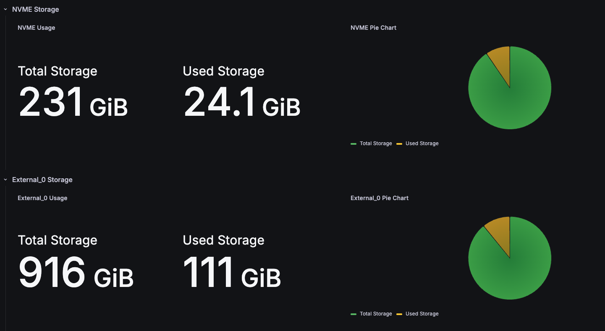

> One of the next steps in my server was adding some more physical storage. I had luckily found a 1TB drive with the help of my aunt, and had to attach it to my server.

First, I had to make sure that the disk was being recognized by the server using `lsblk` where it was listed:

```bash
justinh@thinkpad-ubuntu:~$ lsblk
NAME                      MAJ:MIN RM   SIZE RO TYPE MOUNTPOINTS
sda                         8:0    1     0B  0 disk 
sdb                         8:16   0 931.5G  0 disk 
└─sdb1                      8:17   0 931.5G  0 part 
nvme0n1                   259:0    0 238.5G  0 disk 
├─nvme0n1p1               259:1    0     1G  0 part /boot/efi
├─nvme0n1p2               259:2    0     2G  0 part /boot
└─nvme0n1p3               259:3    0 235.4G  0 part 
  └─ubuntu--vg-ubuntu--lv 252:0    0 235.4G  0 lvm  /
```

Where we can definitely see that it is listed, but not *mounted*.
Knowing that this disk was originally used on a Windows machine, the disk format may be incompatible with Linux. To verify that I was correct, I had to check the format:

```bash
justinh@thinkpad-ubuntu:~$ sudo blkid /dev/sdb1
[sudo] password for justinh: 
/dev/sdb1: LABEL="LaCie" UUID="5EF0-093C" BLOCK_SIZE="512" TYPE="exfat" PARTUUID="76e69e8f-01"
```
> Where we can see that the type is listed as `exfat` here. For Linux compatibility, we should change this to something like `ext4`

```bash
justinh@thinkpad-ubuntu:~$ sudo mkfs.ext4 /dev/sdb1 
mke2fs 1.47.0 (5-Feb-2023)
/dev/sdb1 alignment is offset by 3072 bytes.
This may result in very poor performance, (re)-partitioning suggested.
/dev/sdb1 contains a exfat file system labelled 'LaCie'
Proceed anyway? (y,N)
```
> Where at first, we can see that trying to re-format it we get this problem. This is because I tried to re-format a partition rather than the entire disk.

So, I ran this instead:

```bash
justinh@thinkpad-ubuntu:~$ sudo fdisk /dev/sdb

Welcome to fdisk (util-linux 2.39.3).
Changes will remain in memory only, until you decide to write them.
Be careful before using the write command.


Command (m for help): g
Created a new GPT disklabel (GUID: 529FC5AF-789E-42D4-B442-1287D908831C).
The device contains 'dos' signature and it will be removed by a write command. See fdisk(8) man page and --wipe option for more details.

Command (m for help): n
Partition number (1-128, default 1): 
First sector (2048-1953525133, default 2048): 
Last sector, +/-sectors or +/-size{K,M,G,T,P} (2048-1953525133, default 1953523711): 

Created a new partition 1 of type 'Linux filesystem' and of size 931.5 GiB.

Command (m for help): w
The partition table has been altered.
Calling ioctl() to re-read partition table.
Syncing disks.
```
> Where we just use the default settings to first re-partition the whole disk. Then, we can inform the kernel of these changes using `partprobe`:

```bash
justinh@thinkpad-ubuntu:~$ sudo partprobe /dev/sdb
```

Where we can then, try to reformat the disk in `ext4`o

```bash
justinh@thinkpad-ubuntu:~$ sudo mkfs.ext4 /dev/sdb1
mke2fs 1.47.0 (5-Feb-2023)
Creating filesystem with 244190208 4k blocks and 61054976 inodes
Filesystem UUID: 91d3735f-699f-4e6a-b474-cf914f57972d
Superblock backups stored on blocks: 
	32768, 98304, 163840, 229376, 294912, 819200, 884736, 1605632, 2654208, 
	4096000, 7962624, 11239424, 20480000, 23887872, 71663616, 78675968, 
	102400000, 214990848

Allocating group tables: done                            
Writing inode tables: done                            
Creating journal (262144 blocks): done
Writing superblocks and filesystem accounting information: done   
```

Now we can just mount this disk. First, we want to make a directory in `/mnt` to mount the disk.

```bash
justinh@thinkpad-ubuntu:/mnt$ sudo mkdir data
justinh@thinkpad-ubuntu:/mnt$ ls
data
```

Then, we can get the UUID of the disk,

```bash
justinh@thinkpad-ubuntu:~$ sudo blkid /dev/sdb1
/dev/sdb1: UUID="91d3735f-699f-4e6a-b474-cf914f57972d" BLOCK_SIZE="4096" TYPE="ext4" PARTUUID="3e37404e-4c5d-4b6f-a729-9fdaa522b3c5"
```

And then place that information in `/etc/fstab`
```bash
 16 UUID=91d3735f-699f-4e6a-b474-cf914f57972d       /mnt/data       ext4    defaults        0       2
```

And finally, we can mount it using:
```bash
sudo mount -a
```

Where we can see that it shows in fastfetch now as an external hard drive with ~1TB of storage.
```bash
Disk (/mnt/data)**: 28.00 KiB / 915.82 GiB (0%) - ext4
```

ADD INFORMATION ON MOVING FILES TO HARD DRIVE, AND THEN RE-ROUTING NAVIDROME AND JELLYFIN

ALSO RELAUNCH WITH THE NEW DOCKER-COMPOSE FOR SLSKD

RECONFIGURE JELLYFIN FILES

# Moving files
Now that my external 1TB drive was ready to use, it was time to move all of my large video & music files onto the drive.

Since the standard "mv" command is slow for such large files, we can use `rsync` instead.
Note that before running the below commands, I mounted my new drive at `/mnt/data/` and created a music directory, and video directory separated into shows & movies.

```bash
rsync -avP --remove-source-files video/shows/ /mnt/data/video/shows/
rsync -avP --remove-source-files video/movies/ /mnt/data/video/movies/
rsync -avP --remove-source-files music/ /mnt/data/music/
```
> Where we can transfer a large amount of files using those specific flags to move the files from one drive to another much faster.

Now, it was a matter of changing the `docker-compose` files of both Jellyfin & Navidrome to allow them to access the new file source directories. Respectively, they were changed to be these:

```yml
services:
  navidrome:
    image: deluan/navidrome:latest
    user: "1000:1000" # should be owner of volumes
    ports:
      - "4533:4533"
    restart: unless-stopped
    volumes:
      - "/home/justinh/homelab/navidrome/data:/data"
      - "/mnt/data/music:/music:ro"
```
> Last line changed

```yml
services:
  jellyfin:
    image: jellyfin/jellyfin:latest
    container_name: jellyfin
    # Optional - specify the uid and gid you would like Jellyfin to use instead of root
    user: 1000:1000
    ports:
      - 8096:8096/tcp
      - 7359:7359/udp
    volumes:
      - /jellyfin/config:/config
      - /jellyfin/cache:/cache
      # Separate directories for movies & shows, both are readonly
      - /mnt/data/video/movies:/media/movies:ro
      - /mnt/data/video/shows:/media/shows:ro
    restart: 'unless-stopped'
    # Optional - alternative address used for autodiscovery
    environment:
      - JELLYFIN_PublishedServerUrl=http://example.com
    # Optional - may be necessary for docker healthcheck to pass if running in host network mode
    extra_hosts:
      - 'host.docker.internal:host-gateway'
```
> Bottom two lines in the `volumes` group changed

Now, we simply have to just go to these directories and run these familiar two commands:

```bash
docker compose down
docker compose up -d --force-recreate
```

Where it should be running and getting sources from our new drive!
I went ahead and copied our current Grafana panels, and changed the drive mount points from `/` to `/mnt/data` to display information of our new drive.

