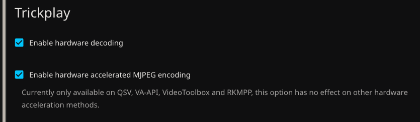

I had always felt like I needed to do more reading in my life, and I never really could figure out a way to make it engaging. I was recommended audiobooks by my girlfriend, and I decided to look into a way to self-host an application to store all of the audiobooks that I could get into, for things like Lord of The Rings which I have always loved as a movie! Because of that, I was able to find [Audiobookshelf](https://www.audiobookshelf.org) which I had decided to use.

# Installation
The first thing I had to do, as usual, was to create a `docker-compose.yml`file. I used this template provided in their documentation.

```yml
services:
  audiobookshelf:
    image: ghcr.io/advplyr/audiobookshelf:latest
    ports:
      - 13378:80
    volumes:
      - </path/to/audiobooks>:/audiobooks
      - </path/to/podcasts>:/podcasts
      - </path/to/config>:/config
      - </path/to/metadata>:/metadata
    environment:
      - TZ=America/Toronto
```
> I noticed that the only things I needed to change were under `volumes` and `environment` which was simple. All I was going to be storing was audiobooks, so I could remove the line with `podcasts`, and I just needed to figure out where I was going to put things like the metadata & config directories.

The first and most obvious place to put the `audiobooks` directory was on my external drive. And then the `config` directory wasn't going to hold much, and that would need to be quickly accessed, so that would go on the NVME, with the Docker information. The `metadata` directory would store things pertaining to the books I would install, so I decided to also put that in the audiobooks directory, just as a subdirectory.

```bash
justinh@thinkpad-ubuntu:/mnt/data/audiobooks$ tree
.
├── backups
├── cache
│   ├── covers
│   │   └── 588babec-3f3b-453d-bfa2-19a4bccc4afb_400.webp
│   ├── images
│   └── items
├── Dungeon Crawler Carl A LitRPGGamelit Adventure
│   ├── cover.jpg
│   ├── Dungeon Crawler Carl A LitRPGGamelit Adventure.cue
│   ├── Dungeon Crawler Carl A LitRPGGamelit Adventure.m4b
│   ├── Dungeon Crawler Carl A LitRPGGamelit Adventure.nfo
│   └── metadata.json
├── items
│   └── 588babec-3f3b-453d-bfa2-19a4bccc4afb
│       └── metadata.json
├── logs
│   ├── daily
│   │   ├── 2026-05-25.txt
│   │   └── 2026-05-26.txt
│   └── scans
│       └── 2026-05-25_ef6e3b70-f788-4d4e-a8b4-fd8643b1672b.txt
├── metadata
└── streams
```

```bash
justinh@thinkpad-ubuntu:~/homelab/audiobookshelf$ tree
.
├── config
│   ├── absdatabase.sqlite
│   └── migrations
│       ├── v2.15.0-series-column-unique.js
│       ├── v2.15.1-reindex-nocase.js
│       ├── v2.15.2-index-creation.js
│       ├── v2.17.0-uuid-replacement.js
│       ├── v2.17.3-fk-constraints.js
│       ├── v2.17.4-use-subfolder-for-oidc-redirect-uris.js
│       ├── v2.17.5-remove-host-from-feed-urls.js
│       ├── v2.17.6-share-add-isdownloadable.js
│       ├── v2.17.7-add-indices.js
│       ├── v2.19.1-copy-title-to-library-items.js
│       ├── v2.19.4-improve-podcast-queries.js
│       ├── v2.20.0-improve-author-sort-queries.js
│       ├── v2.26.0-create-auth-tables.js
│       ├── v2.33.0-add-discover-query-indexes.js
│       └── v2.35.0-add-last-refresh-token.js
└── docker-compose.yml
```

Then, finally, we can just simply look up the specific timezone input that would work here for TZ. All of this is updated & reflected in the `docker-compose`:

```yml
services:
  audiobookshelf:
    image: ghcr.io/advplyr/audiobookshelf:latest
    ports:
      - 13378:80
    volumes:
      - /mnt/data/audiobooks:/audiobooks
      - ./config:/config
      - /mnt/data/audiobooks:/metadata
    environment:
      - TZ=America/Los_Angeles
```

Where finally, we can simply just run this using:

```bash
docker compose up -d
```
> in the `/homelab/audiobookshelf` directory.

## Additional
Later on, I realized that there could be more hardware utilization by my server for *Trickplay* on Jellyfin. Because of that, I had to first enable these two options in Jellyfin settings, and edit my `docker-compose` as is shown below.



```yml
services:
  jellyfin:
    image: jellyfin/jellyfin:latest
    container_name: jellyfin
    user: 1000:1000
    ports:
      - 8096:8096/tcp
      - 7359:7359/udp
    volumes:
      - /jellyfin/config:/config
      - /jellyfin/cache:/cache
      # Separate directories for movies & shows, both are readonly
      - /mnt/data/video/movies:/media/movies:ro
      - /mnt/data/video/shows:/media/shows:ro
    devices:
      - /dev/dri:/dev/dri
    restart: 'unless-stopped'
    environment:
      - JELLYFIN_PublishedServerUrl=http://example.com
    extra_hosts:
      - 'host.docker.internal:host-gateway'
```
> Where we just added the server GPU as the device.

Now, we can just stop and re-run the container.