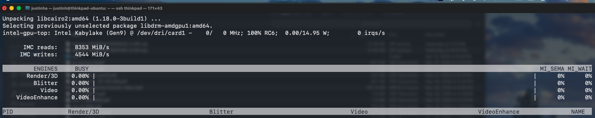
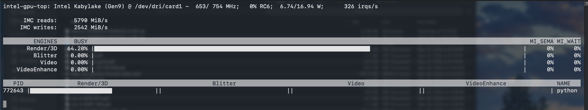

One of the best things that I could do for myself at this point with my server was to store my own photos & videos without relying on Google Photos. This would save me the hassle of worrying about paying a subscription fee for storage, and having actual storage for things like emails.


I figured that the best way to go about this was to search for a way to store images, and I found [Immich](https://immich.app).

# Installation
As usual, the first thing that we need to do is to get a `docker-compose` from the official documentation. They also provide an `.env` file, so we will be downloading both using the provided commands. 

```bash
wget -O docker-compose.yml https://github.com/immich-app/immich/releases/latest/download/docker-compose.yml
wget -O .env https://github.com/immich-app/immich/releases/latest/download/example.env
```

Before editing any of these, let's first make a directory to store all of our photos & videos.

```bash
justinh@thinkpad-ubuntu:~/homelab/immich$ mkdir /mnt/data/photos
```

Now, we can start to edit the `.env` file.

```env
justinh@thinkpad-ubuntu:~/homelab/immich$ cat .env
# You can find documentation for all the supported env variables at https://docs.immich.app/install/environment-variables

# The location where your uploaded files are stored
UPLOAD_LOCATION=/mnt/data/photos

# The location where your database files are stored. Network shares are not supported for the database
DB_DATA_LOCATION=./postgres

# To set a timezone, uncomment the next line and change Etc/UTC to a TZ identifier from this list: https://en.wikipedia.org/wiki/List_of_tz_database_time_zones#List
TZ=America/Los_Angeles

# The Immich version to use. You can pin this to a specific version like "v2.1.0"
IMMICH_VERSION=v2

# Connection secret for postgres. You should change it to a random password
# Please use only the characters `A-Za-z0-9`, without special characters or spaces
DB_PASSWORD=[secret]

# The values below this line do not need to be changed
###################################################################################
DB_USERNAME=postgres
DB_DATABASE_NAME=immich
```
 > Where we just reference the directory that we just made, and just changed the timezone to something that is local to me. The rest can just be left untouched.

Since they made such an easy to configure set of files, we actually don't have to edit the `docker-compose` at all. Thank you Immich developers!

Then, that's about it! The next steps are what I did to move my Google Photos content all onto Immich.

# Cloud Migration
The first thing that we have to do is to go to https://takeout.google.com/.
	Deselect all
	Select Google Photos
Then, scroll to bottom, go to Next, and make these selections:

The best tool that you can use for this transfer is [immich-go](https://github.com/simulot/immich-go). Ideally, you use this, but I had too much trouble with re-downloading a large file, and making many requests for a download with google, so I'll download directly onto my laptop and transfer the large file to my server. But... 

> As the name suggests, we need to install `go` to run this. Be sure to install the right version of go, otherwise it may not work properly, I had to use this command:

```bash
sudo snap install go --classic
```

What I did for my Macbook was actually install `immich-go` on there as well, and move the `immich-go` binary to the `~/Downloads` directory with my desired takeout files. This allows me to use a program specifically designed to transport and import these huge files directly into Immich, rather than dropping the files in via `rsync`, and possibly having to restart the transfer.

```bash
brew install immich-go

cd /opt/homebrew/Cellar/immich-go/0.31.0/bin
cp immich-go ~/Downloads # Where it can be easily accessed and run
```

Now finally, we can just run these commands:

For root user (me):

```bash
./immich-go upload from-google-photos \
  --server=http://[ip]:2283 \
  --api-key=[key] \
  ./takeout-*.zip # Target every takeout file rather than running multiple times
```

For standard user:
```bash
./immich-go upload from-google-photos \
  --server=http://[ip]:2283 \
  --api-key=[user key] \
  --admin-api-key=[my admin key] \
  ./takeout-*.zip
```
> Where including the admin key allows the server to focus resources on this upload rather than utilizing resources while uploading.

Note that for some imports, I also had to use some flags like:
- `--concurrent-tasks=2` to prevent thrashing
- `--client-timeout=2h` for large file imports
- `--on-errors=continue` for problematic imports with constant errors on large files.
## Hardware Acceleration
> Note: I had forgotten two other `yml` files, here is how to get them:
> 1. `cd` into the `immich` directory
> 2. run these commands: 
> 	```bash
> 	wget https://github.com/immich-app/immich/releases/latest/download/hwaccel.transcoding.yml
> 	wget https://github.com/immich-app/immich/releases/latest/download/hwaccel.ml.yml
> 	```

The first thing I had to do was make sure that I could monitor my integrated GPU through installing `intel-gpu-tools`

```bash
sudo apt install intel-gpu-tools
```


> Where we can see here when monitoring it using `sudo intel_gpu_top`, there is zero usage.

Because of this, we have to actually edit the `docker-compose.yml`. We do something similar to what we did with [[Jellyfin]]. 

```bash
services:
  immich-server:
    container_name: immich_server
    image: ghcr.io/immich-app/immich-server:${IMMICH_VERSION:-release}
    extends:
      file: hwaccel.transcoding.yml
      service: quicksync
    devices:
      - /dev/dri:/dev/dri
    volumes:
      - ${UPLOAD_LOCATION}:/data
      - /etc/localtime:/etc/localtime:ro
    env_file:
      - .env
    ports:
      - '2283:2283'
    depends_on:
      - redis
      - database
    restart: always
    healthcheck:
      disable: false

  immich-machine-learning:
    container_name: immich_machine_learning
    image: ghcr.io/immich-app/immich-machine-learning:${IMMICH_VERSION:-release}-openvino
    extends:
      file: hwaccel.ml.yml
      service: openvino
    devices:
      - /dev/dri:/dev/dri
    volumes:
      - model-cache:/cache
    env_file:
      - .env
    restart: always
    healthcheck:
      disable: false
```
> Where we add/uncomment the section beginning with `extends:`, while adding our GPU under `devices:` like we did for Jellyfin. We have to do this for both `immich-server` and `immich-machine-learning`. 

Now, because we changed the actual tag to `immich-machine-learning:release-openvino`, we have to run a different command:

```bash
docker compose pull
```
> What this does is it checks the actual repository instead of just a local change and stopping the container like we usually do, since this is a change to an entirely different image variant. Thus, it needs to be updated as such before running the familiar:

```bash
docker compose up -d
```


> Where we can see that our GPU is now hard at work uploading a test video!