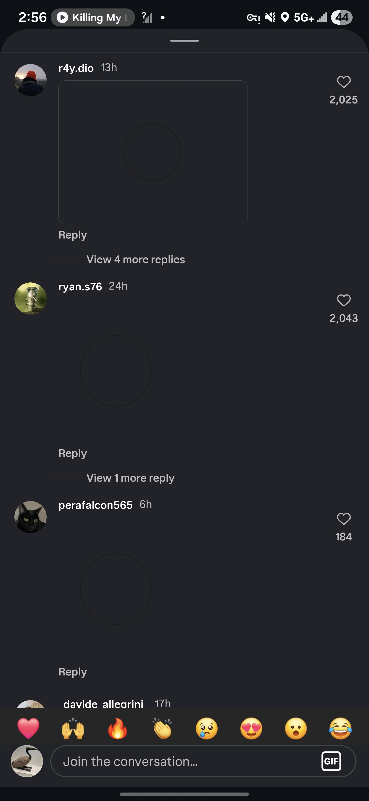
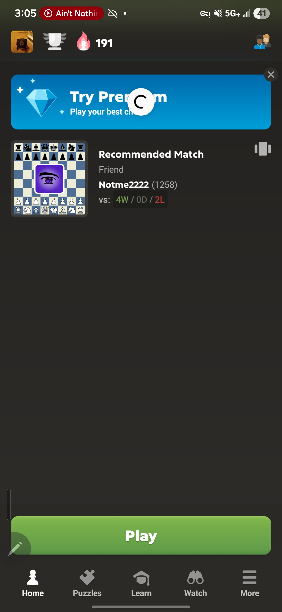
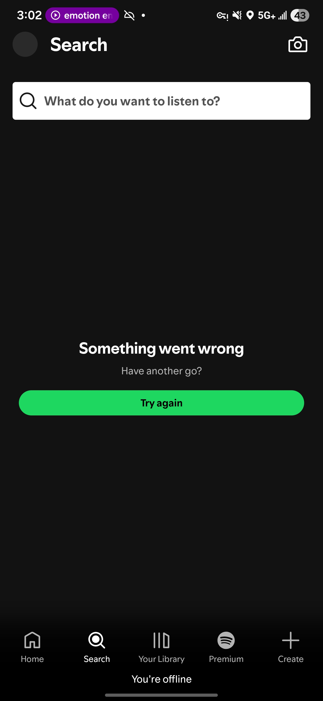
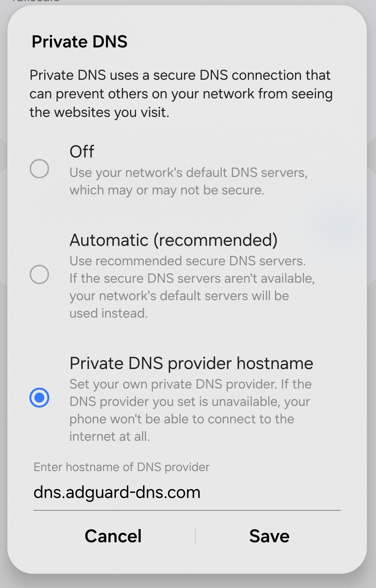

# Navidrome
> Music streaming service from my home server to store my favorite songs and my personal CD collection to play on my phone and my girlfriend's phone, on home network or anywhere.

## Installation process
Like AdGuard DNS, I wanted to use a [Docker](Docker.md) Image to make the installation easy.
I used the official documentation for Navidrome on https://www.navidrome.org/docs/installation/docker/

Using their provided `yml` file outline, I filled mine out like this:
```yaml
services:
  navidrome:
    image: deluan/navidrome:latest
    user: 1000:1000 # should be owner of volumes
    ports:
      - "4533:4533"
    restart: unless-stopped
    volumes:
      - "/home/justinh/navidrome/data:/data"
      - "/home/justinh/music:/music:ro"
```

Where I initially had a file structure where I assumed that data and music had to be packaged together in a single folder, and there were errors. Furthermore, I had to refer to the folders using their absolute path, using `pwd`.

Another issue that I had was that I did not remove the `environment:` key given, since I had not configured any custom options, which was another error when trying to run it in a Docker container.

Finally, I was able to simply run `docker-compose up -d` to run Navidrome in its own container, and verify that it was running with `sudo docker compose logs -f` in the Navidrome directory.

## Using Navidrome & Uploading Music
Due to my earlier choice to use Tailscale, I can use my address provided by TailScale, and the given port number that is reserved for Navidrome to create a user once I verified that the app was working.

Now, the next step was to add music.

There were 2 kinds of music that I was going to add:
1. My own personal CD rips
2. Online-sourced CD rips

For the online CD rips, I used [SoulSeek](https://www.slsknet.org/news/) to find the music, and download it to my personal computer where the rest of my personal CD rips are. Then, copying the pathnames of each album that I was uploading, I was able to run the following command to upload my music to my server (named thinkpad for SSHing)

`scp -r [album-path] thinkpad:~/music`


> Where we can see that after running the command, the files are moved to the server, and are playable through Navidrome

I was able to run this command at home, as well as at school, as long as I was connected to my server via Tailscale.

## Tailscale issues on phone
I had several issues once I established a connection to Tailscale to listen to music.
1. Gif comments were not displaying on Instagram

2. Text messages on Discord were not sending properly

4. Chess app would not load properly

5. Spotify would think that I am offline

6. Network has no internet access error 


### Solution
The issue that I had was that I had a custom Private DNS on my phone to `dns.adguard-dns.com` to block ads. Once I set this to Off, the issue was fixed, resolving the existing DNS settings conflict.



## The issue now became: How was I going to block ads?

The solution to this would be to actually put AdGuard DNS on Tailscale, since I'm already going to be connected to it. That way, there would be no DNS conflict. Since I already have AdGuard DNS running on my home server, there isn't a reason to rely on their public IP address for their ad blocking, as I have my own.


> Now, I simply went onto the Tailscale admin page to add the IP address of my own Thinkpad which is running an active AdGuard container.
