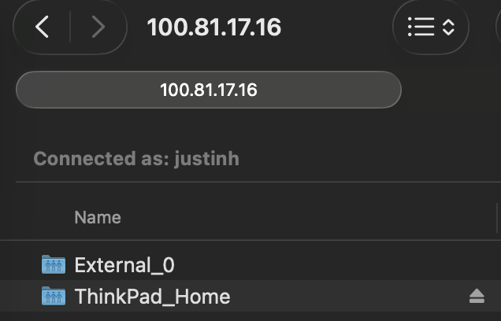

Something that I needed to do constantly, due to how I was downloading video/audio files, was to access my server contents remotely to add files directly onto it. I also needed it when using SoulSeek to remotely share my files with users, vs storing directly on my laptop and consuming large amounts of storage.

The solution that I came to was **SMB**.

## SMB Installation
The first thing that I had to do was to install SMB.

```bash
sudo apt update
sudo apt install samba
```

After this, we have to edit the configuration file to allow me to access certain directories on the home server. Doing this will make it easy to access, and allow me to use my Macbook or Android phone's GUI to access files rather than a CLI.

```bash
sudo vim /etc/samba/smb.conf
```

Now, we can add these lines to the file:

```conf
[ThinkPad_Home]
   comment = Full Access to Home Directory
   path = /home/justinh
   browseable = yes
   read only = no
   guest ok = no
   valid users = justinh
   create mask = 0644
   directory mask = 0755
   force user = justinh
[External_0]
   comment = External Drive that Auntie gave me.
   path = /mnt/data
   read only = no
   guest ok = no
   valid users = justinh
   create mask = 0644
   directory mask = 0755
   force user = justinh
```
> Where the first directory allows me to access the home directory of the homelab, and the second directory allows me to access the 1TB Drive that I had previously re-formatted & mounted onto my server.

Something to note here is that I set it so that it is writeable, and only I can access it with my account `justinh`.
Then, using `0644` for the create mask, it gives me, `justinh` the read/write permissions while group & rest of system have only read permissions.
The same goes for directory mask, with `0755`, but for read, write, and execute for me, and read, and execute, for everyone else.

Then, I just have to set my password and restart SMB.

```bash
sudo smbpasswd -a justinh
sudo systemctl restart smbd nmbd
```

Now, I can access the files remotely.


