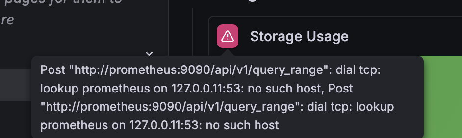

Something that I had to do was prepare my server to be moved from one location to another. Since my server was created using a laptop as a base (ThinkPad T480s), the first step that I had to take was to ensure the battery has a full charge before I took my flight.

```bash
justinh@thinkpad-ubuntu:~$ sudo tlp fullcharge
[sudo] password for justinh: 
Setting temporary charge thresholds for BAT0:
  stop  = 100
  start =  96
Charging starts now, keep AC connected.
```
> Where here, I simply tell `tlp` to charge my laptop fully. This way, the docker containers will still be running on the laptop despite it being disconnected. This will allow me to plug in my laptop when the flight lands and for it to work as it did before.

## Server Ran out of Power
Then, during my relocation, I had let the server intentionally drain its power from 100 to 35 to begin charging to its normal set limits. However, I forgot to plug it in!

So, the very first thing that I had to do was to start all of my containers again, after plugging in and logging into the server.

This was done by simply going into each container's directory and running:
```bash
docker compose up -d
```


## Prometheus Problem
Something that I had noticed at this point was that Prometheus seemed to have a problem.

> It was inaccessible by Grafana. Here, I decided to run `docker compose down`, and relaunch the container again.

```bash
justinh@thinkpad-ubuntu:~/homelab/monitoring$ docker compose up -d
[+] up 3/4
 ✔ Network monitoring_default Created                                                                                       0.0s
 ⠴ Container prometheus       Starting                                                                                      0.7s
 ✔ Container node-exporter    Started                                                                                       0.5s
 ✔ Container grafana          Created                                                                                       0.1s
Error response from daemon: failed to set up container networking: driver failed programming external connectivity on endpoint prometheus (5f2f17ec01838d400dc935c8c1e929d9970df1e631b9a299114c6832b33c669d): failed to bind host port 0.0.0.0:9090/tcp: address already in use
```
> Where we can see here that something is currently occupying the 9090 port that prometheus requires.

I ran this command to find out what was occupying port 9090:

```bash
justinh@thinkpad-ubuntu:~/homelab/monitoring$ sudo lsof -i :9090
[sudo] password for justinh: 
COMMAND PID USER   FD   TYPE DEVICE SIZE/OFF NODE NAME
systemd   1 root  242u  IPv6  11320      0t0  TCP *:9090 (LISTEN)
```
Where this seems to be another cockpit issue. I just ran the following commands to stop & disable cockpit to free port 9090.

```bash
sudo systemctl stop cockpit.socket
sudo systemctl disable cockpit.socket
```

Then finally, we can just start the container again using this command:

```bash
docker compose up -d
```

And the monitoring works!


Then, the rest of the issues that I had was that I had to navigate Xfinity's mobile app to enable AdGuard Home to work on my home network for other devices.